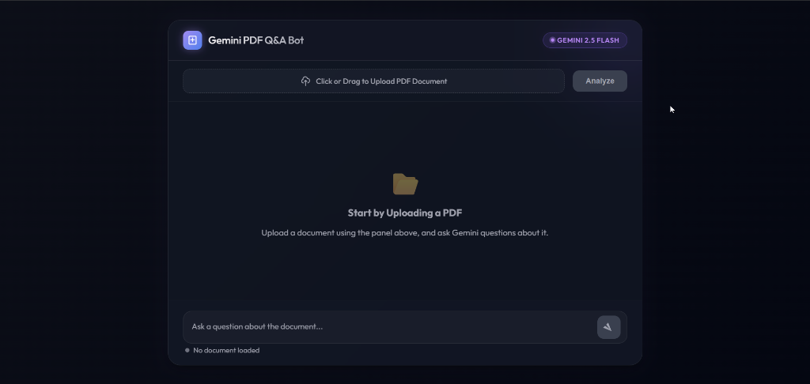

# 🤖 Gemini PDF Q&A Bot (RAG Application)

A modern, responsive Retrieval-Augmented Generation (RAG) web application that allows users to upload PDF documents and ask questions about their content. The system uses advanced document processing, embeddings, and vector stores to retrieve context and generate accurate, context-grounded responses using **Google Gemini**.

---

## 📸 App Preview



---

## ✨ Features

- **Document Upload & Analysis**: Upload PDF files directly through the clean drag-and-drop web interface.
- **RAG Pipeline**:
  - **Document Loader**: Extracts text from PDFs using `PyPDFLoader`.
  - **Text Splitter**: Chunks documents into manageable segments using `RecursiveCharacterTextSplitter`.
  - **Embeddings**: Generates semantic embeddings using Hugging Face's `all-MiniLM-L6-v2` model.
  - **Vector Database**: Stores chunk embeddings in an in-memory `Chroma` database for fast semantic retrieval.
- **Conversational Memory**: Retains session history to handle multi-turn follow-up questions contextually.
- **Strict Grounding Rules**: The assistant answers questions *only* using information explicitly present in the document.

---

## 🛠️ Tech Stack

- **Frontend**: Clean, premium dark-themed UI built with Vanilla HTML/CSS & JavaScript.
- **Backend**: Lightweight python web server built with **Flask**.
- **Orchestration**: **LangChain** ecosystem (`langchain-core`, `langchain-community`, `langchain-chroma`, `langchain-huggingface`).
- **LLM**: **Google Gemini (`gemini-2.5-flash`)** via `langchain-google-genai`.

---

## 🚀 Getting Started

Follow these steps to run the application locally:

### 1. Prerequisites
Ensure you have **Python 3.10+** installed on your machine.

### 2. Setup Directory & Virtual Environment
Navigate to the project folder and activate the virtual environment:

* **Windows (PowerShell)**:
  ```powershell
  .\.venv\Scripts\Activate.ps1
  ```
* **Windows (Command Prompt)**:
  ```cmd
  .\.venv\Scripts\activate.bat
  ```
* **macOS / Linux**:
  ```bash
  source .venv/bin/activate
  ```

### 3. Install Dependencies
Install all required libraries using pip:
```bash
pip install -r requirements.txt
```

### 4. Configure Environment Variables
Create a `.env` file in the root directory (or edit the existing one) and add your Google Gemini API key:
```env
GOOGLE_API_KEY=your_gemini_api_key_here
```

### 5. Run the Application
Start the Flask web server:
```bash
python app.py
```

### 6. Access the Application
Open your web browser and go to:
👉 **[http://127.0.0.1:5000](http://127.0.0.1:5000)**

---

## 📂 Project Structure

```text
├── .venv/                  # Python Virtual Environment
├── templates/
│   └── index.html          # Web frontend template
├── uploads/                # Directory where uploaded PDFs are stored
├── .env                    # Environment variables (API Keys)
├── .gitignore              # Files/folders ignored by Git
├── app.py                  # Flask web server routes
├── qabot.py                # RAG pipeline implementation
├── requirements.txt        # Pinned Python package dependencies
├── screenshot.png          # App interface preview image
└── README.md               # Project documentation (this file)
```
